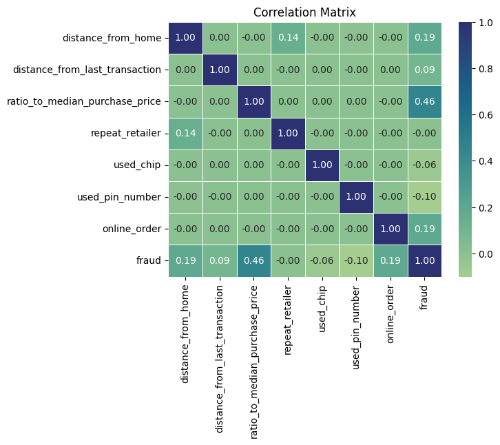
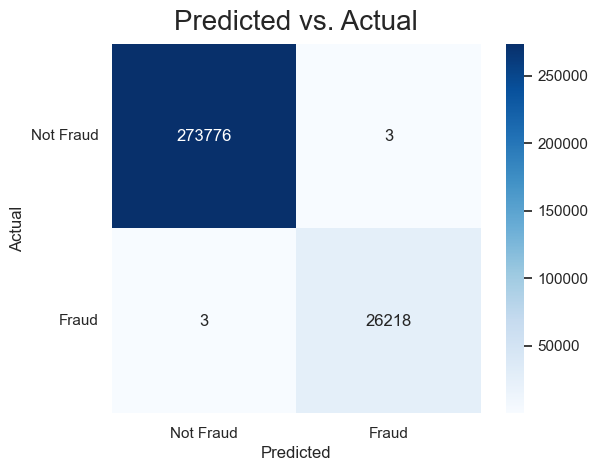
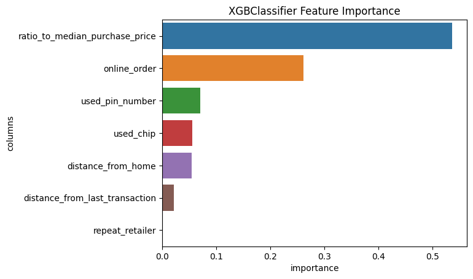
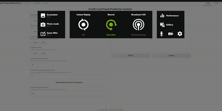

<h1 align="center">Credit Card Fraud Detection</h1>

  

  
  
  
  
  
  
  
  

  

    Badge <a href="https://shields.io/">Source</a>
  

  <h2>Authors</h2>
  <ul>
    <li><a href="https://github.com/luisosorio3214">@luisosorio3214</a></li>
  </ul>

  <h2>Table of Contents</h2>
  <ul>
    <li><a href="#business-problem" target="_parent">Business Problem</a></li>
    <li><a href="#data-source">Data Source</a></li>
    <li><a href="#methods">Methods</a></li>
    <li><a href="#tech-stack">Tech Stack</a></li>
    <li><a href="#quick-glance">Quick glance at the Results</a></li>
    <li><a href="#lesson-learned">Lessons learned and Recommendation</a></li>
    <li><a href="#limitation">Limitation and what can be Improved</a></li>
    <li><a href="#local">Run Locally</a></li>
    <li><a href="#notebook">Explore the notebook</a></li>
    <li><a href="#gradio">Deployment on Gradio</a></li>
    <li><a href="#deployed">App deployed on Gradio</a></li>
    <li><a href="#contribution">Contribution</a></li>
    <li><a href="#license">License</a></li>
  </ul>

  <section id="business-problem">
    <h2>Business Problem</h2>
    

      Credit card frauds have always been a major concern for banking and financial institutions which result in unnecessary fees taken. Fraudster have several methods in achieving these unauthorized transactions and we wish to identify key components that help identify a fraudulent transaction. The idea is if we can correctly identify a fraudulent transaction we can stop the transaction from going through and save the money from being taken. In order to achieve this goal we need a policy that helps determine fraudulent transaction at the expense of not misclassifying a transaction as fraudulent which can also increase costs. We need an efficient system that balances in identification of normal and fraudulent transactions. 
    

  </section>

  <section id="data-source">
    <h2>Data Source</h2>
    <ul>
      <li><a href="https://drive.google.com/drive/folders/11M7SStUHBRzWhk4VpHA2TjzRsH9jOpzA?usp=share_link">My Google Drive</a></li>
    </ul>
  </section>

  <section id="methods">
    <h2>Methods</h2>
    <ul>
      <li>Exploratory Data Analysis</li>
      <li>Multivariate Analysis</li>
      <li>Visualizations</li>
      <li>Modeling</li>
      <li>App Deployment</li>
    </ul>
  </section>

  <section id="tech-stack">
    <h2>Tech Stack</h2>
    <ul>
      <li>Python (Machine Learning Modeling and App preparation)</li>
      <li>AWS S3 (Model Storage)</li>
      <li>Gradio (Interface for app)</li>
      <li>Hugging Face (App Deployment)</li>
    </ul>
  </section>

  <section id="quick-glance">
    <h2>Quick Glance at the Results</h2>
    

      Correlation Matrix between numeric features.
      

        
      

    
  
    

      Confusion Matrix of XGBoost Classifier (Testing Set).
      

        
      

    

    

      XGboost Feature Importance Plot.
      

        
      

    

    

      Top 3 models on the testing set (with default parameters)
      <table style="width:100%">
        <tr>
          <th>Model</th>
          <th>Best Threshold</th>
          <th>F1 Score</th>
          <th>Accuracy</th>
          <th>Recall</th>
          <th>Precision</th>
        </tr>
        <tr>
          <td>Logistic Regression</td>
          <td>0.315789</td>
          <td>79.48%</td>
          <td>96.5%</td>
          <td>76.67%</td>
          <td>82.5%</td>
        </tr>
        <tr>
          <td>Random Forest</td>
          <td>0.315789</td>
          <td>99.9%</td>
          <td>99.9%</td>
          <td>99.9%</td>
          <td>100%</td>
        </tr>
        <tr>
          <td>XGBoost</td>
          <td>0.105263</td>
          <td>99.9%</td>
          <td>99.9%</td>
          <td>99.9%</td>
          <td>99.9%</td>
        </tr>
      </table>
      

      

        <ul>
          <li>Final Model used: XGBoost Classifier</li>
          <li>Metric used: Recall, Precision, and Accuracy</li>
          <li>What is the meaning behind the threshold?: The threshold is the probability set in order for us to  classify a transaction as a fraudulent one. Therefore if the probability provided by our XGboost Classifier for being a fraudulent transaction was greater than 10.5%, then the transaction would be classified as a fraudulent one. This threshold was computed by checking random probabilities and picking the ones that returned the highest metrics when it came down to F1 score, accuracy, recall and precision. Remember we want to find a balance between correctly identifying fraudulent transaction and not misclassifying normal transaction as being fraud since this misidentification could cost a company a lot of money. Therefore, in terms of our metrics this means we want the best scores when it came down to only recall, precision, and accuracy. Where recall is the score that correctly identifies fraudulent transaction. Precision is the score in correctly identifying fraudulent transaction divided by the total number labelled as fraudulent transaction even the ones that weren't. Accuracy is the score of our model that correctly identifying the transactions correctly.</li>
        </ul>
      

    

  </section>

  <section id="lesson-learned">
  <h2>Lessons Learned and Recommendation</h2>
  

    <ul>
      <li>In this project I learned how to leverage feature importance using our Random Forest and Gradient Boosting models to determine what influences our response the most. Its important to note that some features might provide a negative influence to our response variable or a positive one. Since the goal for this project is to increase satisfactory level, we want to identify not only the top important features but also the ones that provide positive influence. For example, Cleanliness is a feature given and some logic would say as we decrease cleanliness so would satisfaction levels. This can also be said in reverse if we increase cleanliness then you would expect customers to be more satisfied with their experience, thus this feature provides a positive influence. A negative influence would say if we increase a feature then satisfaction level would decrease or vice-versa.</li> 
    </ul>
  

  <section id="limitation">
    <h2>Limitation and what can be Improved</h2>
    

      <ul>
        <li>Note: Based on the feature importance plot we can see that ratio to median purchase price had one of the greatest influence in predicting a fraudulent transaction. Now the ratio is computed by taking the purchase price and dividing it by the median purchase price used on the card. Therefore, we must know the transaction price that fraudster performed, limiting the model from stopping the transaction before it even occurs. Also we must have a median purchase price on the card, but what if theres no history on the card. What do we use as the median purchase price for the card?</li>
        <li>In order to improve our model we would require more attributes for our data. If you take a close look we are only using 7 predictors in order to determine our target/response of a fraudulent transaction. We can take more information on the card and the owner to determine more spending habits or calculate more probabilities that the transaction was in fact the owner.</li>
        <li>Also in order to implement a system that stops a transaction before going through when the system believes it is a fraudulent one would require a whole new transactional system across all stores. Currently when you buy or receive a refund from a store, it may be instant to you but in the backend the process takes days. This leads to issues since we would want to stop transaction from going through therefore we would need some fast transactional system to achieve this. Just recently the U.S. government approved such systems which they have been testing since 2019, I believe it will go live this month in July 2023. </li>
      </ul>
    

  </section>

  <section id="local">
    <h2>Run Locally</h2>
    

      First, Open your Command line or Terminal and head to a directory where you want to save the project.
    
    
      <h4>Initialize git</h4>
        <pre>
          <code style="height: 50%;">
          git init
          </code>
        </pre>
      <h4>Clone the Project</h4>
        <pre>
          <code style="height: 50%;">
          git clone https://github.com/luisosorio3214/Credit-Card-Fraud-Detection-.git
          </code>
        </pre>
      <h4>Head to project directory</h4>
        <pre>
          <code style="height: 50%;">
          cd Credit-Card-Fraud-Detection-
          </code>
        </pre>
      <h4>Create a virtual environment using venv</h4>
        <pre>
          <code style="height: 50%;">
          python -m venv "env_name"
          </code>
        </pre>   
      <h4>Activate virtual environment</h4>
        <pre>
          For Window Users
          <code style="height: 50%;">
            env_name\Scripts\activate
          </code>
          For Mac Users
          <code style="height: 50%;">
            source env_name/bin/activate
          </code>
        </pre>
      <h4>Install required dependencies from requirements.txt file</h4>
        <pre>
          <code style="height: 50%;">
          pip install -r requirements.txt
          </code>
        </pre>
      <h4>Run the Python app</h4>
        <pre>
          <code style="height: 50%;">
          python run app.py
          </code>
        </pre>
      
A local link would be generated on your machine. Clcik the link and it would lead you to the app.

    

    If you are having issues with Gradio, please follow the documentation<a href="https://www.gradio.app/guides/quickstart">here</a>. 
    

  </section>

  <section id="notebook">
  <h2>Explore the Jupyter Notebook</h2>
  

    To explore the notebook click <a href="https://github.com/luisosorio3214/Credit-Card-Fraud-Detection-/blob/main/Credit%20Card%20Fraud.ipynb">here</a>.
  

  </section>

  <section id="Gradio">
  <h2>Deployment on Gradio</h2>
  

    To deploy this project on Gradio app, We will use Hugging Face - Spaces:  
    Create a <a href="https://huggingface.co/welcome">Hugging Face Account</a>, then you have three methods to deploy your Gradio app to Hugging Face Spaces.
    <ol>
      <li>From terminal: run gradio deploy in your app directory. The CLI will gather some basic metadata and then launch your app. To update your space, you can re-run this command or enable the Github Actions option to automatically update the Spaces on git push.</li>
      <li>From your browser: Drag and drop a folder containing your Gradio model and all related files <a href="https://huggingface.co/new-space">here</a>.</li>
      <li>Connect Spaces with your Git repository and Spaces will pull the Gradio app from there. See this <a href="https://huggingface.co/blog/gradio-spaces">guide how to host on Hugging Face Spaces</a> for more information.</li>
    </ol>
  

  </section>

  <section id="deployed">
  <h2>App deployed on Gradio</h2>
  
  

    Video to gif <a href="https://ezgif.com/">tool</a>
  

  </section>

  <section id="contribution">
    <h2>Contribution</h2>
    

      Pull requests are welcome! For major changes, please open an issue first to discuss what you would like to change or contribute.
    

  </section>

  <section id="license">
    <h2>License</h2>
    

      MIT License    
      Copyright (c) 2022 Stern Semasuka    
      Permission is hereby granted, free of charge, to any person obtaining a copy
      of this software and associated documentation files (the "Software"), to deal
      in the Software without restriction, including without limitation the rights
      to use, copy, modify, merge, publish, distribute, sublicense, and/or sell
      copies of the Software, and to permit persons to whom the Software is
      furnished to do so, subject to the following conditions:    
      The above copyright notice and this permission notice shall be included in all
      copies or substantial portions of the Software.   
      THE SOFTWARE IS PROVIDED "AS IS", WITHOUT WARRANTY OF ANY KIND, EXPRESS OR
      IMPLIED, INCLUDING BUT NOT LIMITED TO THE WARRANTIES OF MERCHANTABILITY,
      FITNESS FOR A PARTICULAR PURPOSE AND NONINFRINGEMENT. IN NO EVENT SHALL THE
      AUTHORS OR COPYRIGHT HOLDERS BE LIABLE FOR ANY CLAIM, DAMAGES OR OTHER
      LIABILITY, WHETHER IN AN ACTION OF CONTRACT, TORT OR OTHERWISE, ARISING FROM,
      OUT OF OR IN CONNECTION WITH THE SOFTWARE OR THE USE OR OTHER DEALINGS IN THE
      SOFTWARE.   
      Learn more about <a href="https://choosealicense.com/licenses/mit/"> MIT </a> license
    

  </section>

